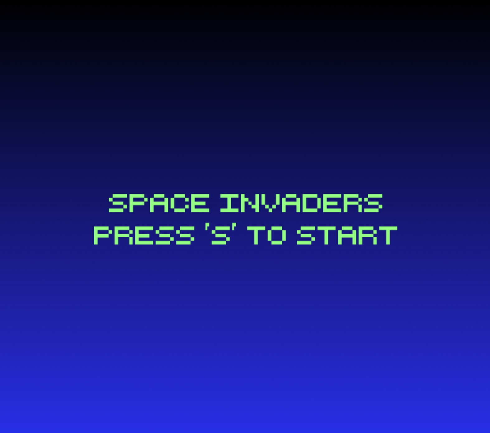

# 👾 Space Invaders  

A modern take on the classic **Space Invaders** arcade game!  
Built as a fun project to practice game design, programming, and pixel-perfect polish.  


## 🎮 Features
- Classic arcade-style gameplay  
- Increasing difficulty with each wave  
- Smooth controls for movement and shooting  
- Retro-inspired visuals
  

## 🕹️ Controls
- **Arrow Keys** → Move left and right  
- **Spacebar** → Shoot    


## 🚀 Getting Started
1. Clone this repository  
   ```bash
   git clone https://github.com/fuengana/space-invaders.git
   cd space-invaders


## Run The Game 
python3 space-invaders
